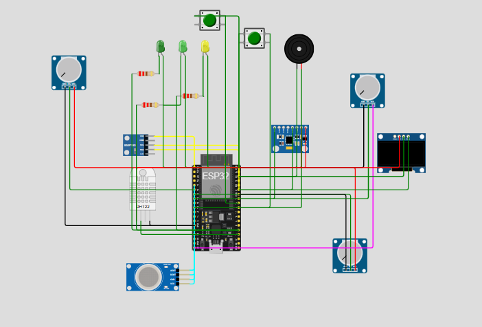

# ⛏️ Smart Miner Safety Monitoring System (ESP32)

## 📌 Overview
This project presents a **Smart Miner Safety Monitoring System** designed to enhance safety in underground mining environments. The system continuously monitors environmental and physical conditions such as temperature, humidity, gas concentration, and worker movement.

If any unsafe condition is detected, the system immediately triggers alerts using a buzzer and LED while displaying real-time data on an OLED screen.

---

## ⚙️ Key Features
- 🌡️ Temperature & Humidity Monitoring (DHT22)
- ☣️ Gas Detection (simulated MQ sensors)
- 🧭 Fall Detection (MPU6050)
- 🚨 Emergency SOS Button
- 📍 Location Tracking (Dummy GPS in simulation)
- 📺 OLED Display for real-time data
- 🔊 Buzzer & LED alerts for danger detection

---

## 🧩 Components Used

### ✅ Actual Hardware Components
- ESP32 DevKit (Main Controller)
- DHT22 Sensor (Temperature & Humidity)
- MPU6050 (Accelerometer & Gyroscope)
- OLED Display (SSD1306)
- Push Buttons (SOS trigger)
- Buzzer (Alarm system)
- LEDs with resistors

### ⚠️ Simulated Components (Wokwi)
- MQ Gas Sensors (replaced by potentiometers)
- Oxygen sensor (simulated using analog input)
- GPS module (dummy coordinates used)
- BMP180 (present but not used due to compatibility)

---

## 🔌 Pin Configuration

| Component        | ESP32 Pin | Purpose |
|----------------|----------|--------|
| DHT22 DATA     | GPIO 15  | Temp & humidity input |
| MPU6050 SDA    | GPIO 21  | I2C communication |
| MPU6050 SCL    | GPIO 22  | I2C communication |
| OLED SDA       | GPIO 21  | I2C display |
| OLED SCL       | GPIO 22  | I2C display |
| Gas Sensor     | GPIO 34  | Analog input |
| CO Sensor      | GPIO 32  | Analog input |
| Oxygen Sensor  | GPIO 35  | Analog input |
| Button 1 (SOS) | GPIO 5   | Emergency input |
| Button 2       | GPIO 18  | Additional trigger |
| Buzzer         | GPIO 26  | Alert output |
| LED            | GPIO 2   | Visual alert |

---

## 🧠 Working Principle

1. The system collects data from multiple sensors:
   - DHT22 → Temperature & humidity
   - MPU6050 → Motion/fall detection
   - Potentiometers → Simulated gas levels

2. The microcontroller processes this data and compares it with predefined thresholds.

3. If unsafe conditions are detected:
   - 🔊 Buzzer is activated
   - 💡 LED is turned ON

4. Real-time data is displayed on the OLED screen and serial monitor.

---

## 🚨 Safety Conditions

| Condition | Description |
|----------|------------|
| High Temperature | Temperature exceeds safe limit |
| Gas Leakage | High analog gas value |
| Low Oxygen | Oxygen level drops below threshold |
| Fall Detection | Sudden abnormal acceleration |
| SOS Button | Manual emergency trigger |

---

## 💻 Simulation Details

- Platform: Wokwi Simulator
- Gas sensors replaced with potentiometers
- GPS simulated using fixed coordinates:
  - Latitude: 28.6139
  - Longitude: 77.2090

---

## 🛠️ Hardware Implementation Guide

To convert this simulation into a real-world miner safety system:

1. Replace potentiometers with real MQ gas sensors (MQ2, MQ7, etc.)
2. Add a **10k pull-up resistor** between DHT DATA and VCC
3. Use a real GPS module (e.g., NEO-6M)
4. Ensure proper grounding for all components
5. Use a stable power supply for ESP32
6. Enclose system in a rugged, dust-proof casing for mining conditions

---

## 🧠 Key Learning Outcomes

- Integration of multiple sensors with ESP32
- Use of I2C communication protocol
- Real-time monitoring and alert systems
- Simulation vs real hardware differences
- Debugging sensor communication issues

---

## 🖼️ Simulation Diagram

## 🖼️ Simulation Diagram

  

Below is the simulation setup created in Wokwi showing all connections between ESP32 and sensors:

[ESP32] ─── I2C ─── [MPU6050]
│
├── I2C ─── [OLED Display]
│
├── GPIO15 ─── [DHT22]
│
├── ADC ─── [Gas Sensors (via Potentiometers)]
│
├── GPIO5 / GPIO18 ─── [Push Buttons]
│
├── GPIO26 ─── [Buzzer]
│
└── GPIO2 ─── [LED]

> 📌 Note: In Wokwi, gas sensors and oxygen sensor are simulated using potentiometers.

---

## 🎯 Conclusion

This project demonstrates a reliable and scalable **smart safety system for miners**, capable of detecting hazardous conditions and providing immediate alerts. It can be further enhanced with IoT connectivity for remote monitoring and real-time tracking.

---

## 👩‍💻 Author
**Anand Ambastha**

